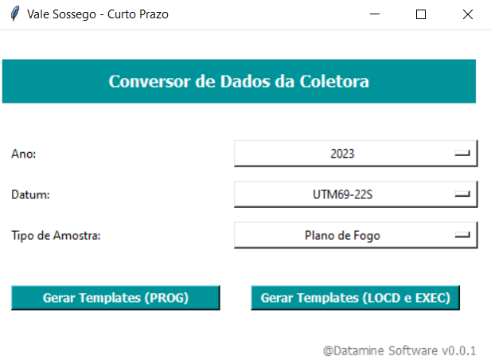

# SSG-Collector-Converter

## Descrição
Aplicativo que converte dados da coletora de campo do Curto Prazo da Vale Sossego em templates de importação do Sample Station.

## Utilização do Aplicativo
 A figura abaixo mostra a interface do aplicativo:

 

   

 - No campo **Ano**, selecione o ano em que o plano de perfuração foi realizado
 - No campo **Datum**, selecione o datum adequado das coordenadas adquiridas em campo
 - No campo **Tipo de Amostra**, selecione o tipo de amostra em questão

### Gerando Templates - Amostras Programadas
1. Para gerar os templates de amostras programadas, clique no botão **Gerar Templates (PROG)**;
2. Na janela do Explorador de Arquivos do Windows, selecione a pasta que contenha os arquivos .txt da coletora, ou seja, aqueles que contém apenas as coordenadas PROGRAMADAS;
3. Se não ocorrer nenhum erro, serão gerados dois templates por arquivo .txt na mesma pasta selecionada no item anterior:
    - **Samples**: contém os dados de cabeçalho das amostras (nomenclatura: `Nome do plano de perfuração + _prog_samples.csv`)
    - **Coordinates**: contém os dados de coordenadas PROGRAMADAS das amostras (nomenclatura: `Nome do plano de perfuração + _prog_coordinates.csv`)

**ATENÇÃO:** A pasta selecionada no item 2 deve conter apenas arquivos .txt no formato da coletora, caso contrário ocorrerá erro na execução do aplicativo.

### Gerando Templates - Amostras Locadas e Executadas
1. Para gerar os templates de amostras locadas e executadas, clique no botão **Gerar Templates (LOCD e EXEC)**;
2. Na janela do Explorador de Arquivos do Windows, selecione a pasta que contenha os arquivos .csv da coletora, ou seja, aqueles que contém apenas as coordenadas LOCADAS e EXECUTADAS;
3. Se não ocorrer nenhum erro, serão gerados dois templates por arquivo .csv na mesma pasta selecionada no item anterior:
    - **Samples**: contém os dados de cabeçalho das amostras (nomenclatura: `Nome do plano de perfuração + _locd_exec_samples.csv`)
    - **Coordinates**: contém os dados de coordenadas LOCADAS (se houver) e EXECUTADAS das amostras (nomenclatura: `Nome do plano de perfuração + _locd_exec_coordinates.csv`)

**ATENÇÃO:** A pasta selecionada no item 2 deve conter apenas arquivos .csv no formato da coletora, caso contrário ocorrerá erro na execução do aplicativo.

## Premissas
As seguintes premissas foram acordadas para o desenvolvimento do aplicativo:

- O nome dos arquivos da coletora (.txt e .csv) sempre é igual ao nome do plano de perfuração.
  - *Exemplo*: E6_-152_012a.txt e E6_-152_012a.csv
- O usuário sempre gerará os templates de **amostras programadas** a partir de **arquivos .txt** da coletora.
- O usuário sempre gerará o template de **amostras locadas e executadas** a partir de **arquivos .csv** gerado pela coletora.
- A pasta selecionada para gerar os templates de **amostras programadas** deve conter apenas arquivos .txt no padrão da coletora.
- A pasta selecionada para gerar os templates de **amostras locadas e executadas** deve conter apenas arquivos .csv no padrão da coletora.
- Ao clicar no botão `Gerar Templates (PROG)`, são gerados sempre dois templates (.csv) para cada arquivo da coletora (.txt) existente na pasta selecionada:
  - **Samples**: contém os dados do cabeçalho das amostras.
    - Nomenclatura: *Nome do plano de perfuração + _prog_samples.csv*
  - **Coordinates**: contém os dados de coordenadas PROGRAMADAS das amostras.
    - Nomenclatura: *Nome do plano de perfuração + _prog_coordinates.csv*
- Ao clicar no botão `Gerar Templates (LOCD e EXEC)`, são gerados sempre dois templates (.csv) para cada arquivo da coletora (.csv) existente na pasta selecionada:
  - **Samples**: contém os dados do cabeçalho das amostras.
    - Nomenclatura: *Nome do plano de perfuração + _locd_exec_samples.csv*
  - **Coordinates**: contém os dados de coordenadas PROGRAMADAS das amostras.
    - Nomenclatura: *Nome do plano de perfuração + _locd_exec_coordinates.csv*
- Todos os arquivos da coletora (.txt e .csv) devem ter o sequencial do número da amostra preenchido.
- O arquivo da coletora (.csv) deve ter coordenadas locadas e executadas ou apenas coordenadas executadas. A situação em que esse arquivo apresenta apenas coordenadas locadas não foi considerada nas premissas.

  ## Versões do Software
  - **Python v3.9.17**
  - **Numpy v1.25.2**
  - **Pandas v2.0.3**
  - **PyInstaller v5.13.0**
